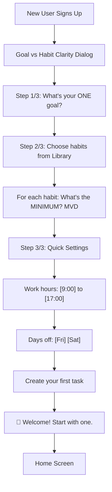
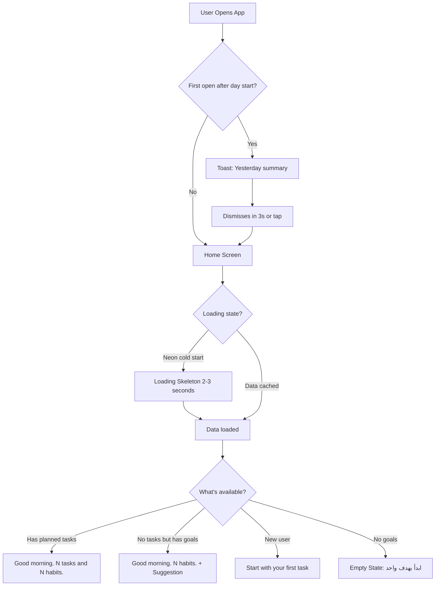
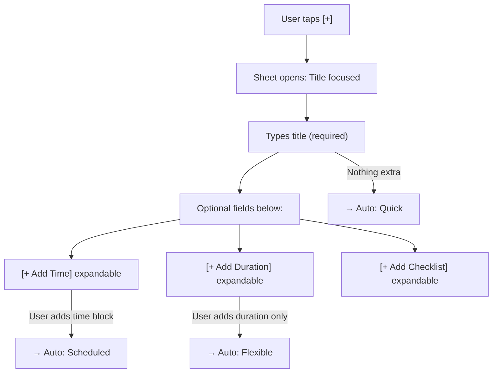
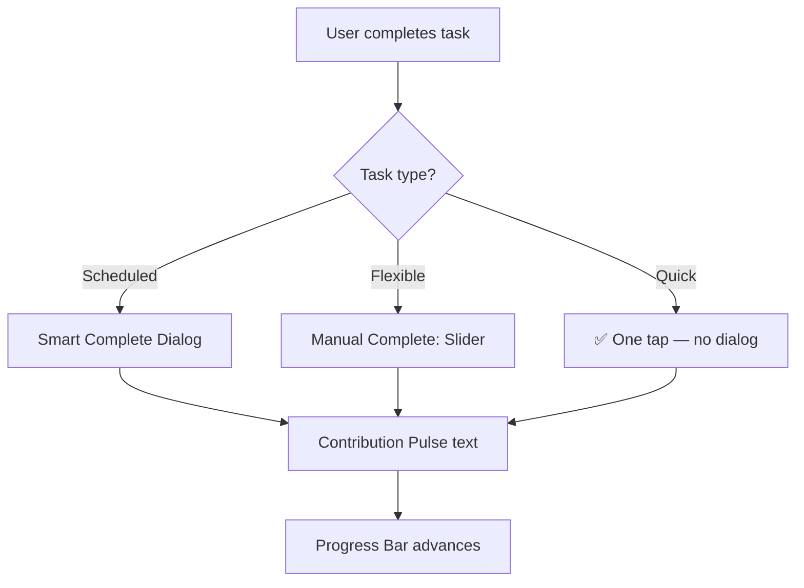
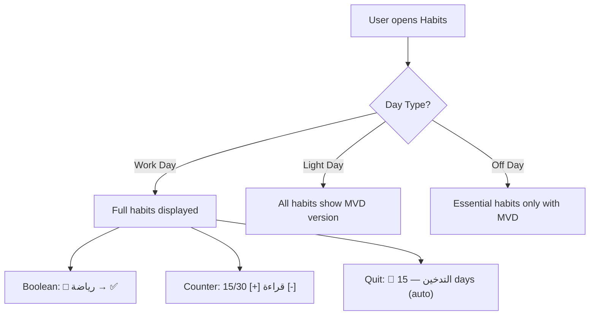
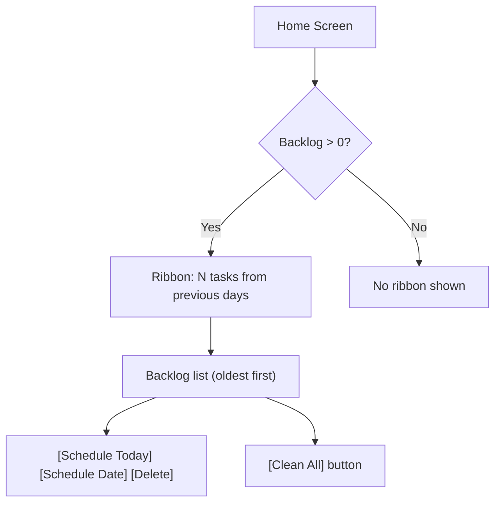

# 📐 مواصفات تجربة المستخدم (UX Design Spec) — "هدف" (Hadaf) v2.0 — MVP

> **آخر تحديث:** يونيو ٢٠٢٥
> **النطاق:** المرحلة الأولى — MVP فقط

---

## 1. Executive Summary

### 1.1 Project Vision

Hadaf (هدف) is a **resilient, capacity-aware life management system** built to combat "all-or-nothing" burnout. It shifts the paradigm from simple task tracking to **Elastic Motivation**, where the system adapts to the user's day type and protects their identity through setbacks.

The system operates on a single architectural principle:

> **"النظام يفكر بدل المستخدم. المستخدم يوافق أو يعدّل — لا يُنشئ من الصفر."**

### 1.2 Target Users (MVP)

| Persona | Core Need | Key UX Moment |
|---|---|---|
| **Ahmed (Student)** | Overwhelmed by deadlines | Sees Daily Capacity warning |
| **Muna (Professional)** | Balanced achiever | Automatic Day Types + capacity management |
| **Khaled (Achiever)** | Streak-sensitive | MVD preserve his streak on bad days |

### 1.3 MVP Motion Strategy

> **MVP uses CSS Transitions only — no Framer Motion dependency.**

| Interaction | MVP Implementation |
|---|---|
| Task completion | Tap-to-complete (checkbox/button) |
| Contribution Pulse | CSS fade text: "+X% نحو [هدف]" (3 seconds) |
| Progress update | CSS transition on progress bar width (500ms) |
| Day State badge | CSS fade-in (300ms) |
| Daily Summary dismiss | CSS slide-out (200ms) |
| Toast messages | CSS fade in/out (200ms) |
| Skeleton shimmer | 1500ms infinite |

---

## 2. Core User Experience

### 2.1 Defining Experience

The heartbeat of Hadaf is making daily tasks feel **strategically meaningful**. When you complete a task, you see "+X% نحو [هدف]" — your small act moved you closer to your 12-week goal.

**MVP:** This is achieved through text-based Contribution Pulse (CSS fade) and static Goal Tether lines connecting tasks to goals on the Goals dashboard.

### 2.2 Platform Strategy

A **Mobile-First Responsive Web App** optimized for "In-Between Moments." Interaction is designed for "High-Stress/Low-Willpower" contexts — large targets, simple sliders, calm adaptive palette.

**MVP:** Tap-to-complete interactions. CSS transitions only.

### 2.3 Experience Principles

| Principle | Description | Implementation |
|---|---|---|
| **Willpower Stewardship** | Protect the user's finite daily focus | Auto Daily Capacity, no morning questions |
| **Intrinsic Visibility** | Goals must be connected to tasks | Contribution Pulse text, Goal health dots |
| **Elastic Resilience** | Design for the "Bad Day" as primary state | MVD, Good Enough Day |
| **Human Recognition** | Celebrate showing up | "أنجزت ٥ من ٨ — إنجاز حقيقي" messaging |
| **Automatic Intelligence** | The system decides; the user approves | 3 auto task types, auto capacity |

### 2.4 MVP Novel UX Patterns

| Pattern | Description |
|---|---|
| **Auto-Type Detection** | Task form adapts based on what user fills (title only → Quick; +duration → Flexible; +time → Scheduled) |
| **MVD Toggle** | On Light Days, all habits auto-switch to minimum version |
| **Backlog Ribbon** | Persistent but unobtrusive strip: "N tasks from previous days" |
| **Good Enough Badge** | 50-99% days celebrated with "💪 يوم جيد بما فيه الكفاية" |
| **Contribution Pulse (text)** | "+X% نحو [هدف]" CSS fade text on task completion |
| **Goal Health Dots** | 🟢🟡🟠🔴 colored dot next to each goal |
| **Checklist Progress** | Simple checklist inside tasks with progress bar |

---

## 3. System Messaging Philosophy: "Good Enough"

```
❌ "لم تكمل ٣ مهام"        → ✅ "أنجزت ٥ من ٨ — إنجاز حقيقي"
❌ "No tasks today"        → ✅ "هدفك [X] يحتاج اهتمام. أضف مهمة؟"
❌ "Error occurred"        → ✅ "فشل الحفظ. [حاول مرة أخرى]"

Rule: What you accomplished FIRST, then what remains.
Rule: Errors are recoverable. Always show a retry action.
```

---

## 4. Design System Foundation

### 4.1 Design System Choice

**Tailwind CSS + Shadcn UI.** CSS Transitions for all motion.

### 4.2 Implementation Approach

| Layer | Technology |
|---|---|
| **Base Components** | Shadcn UI |
| **Atomic Styling** | Tailwind CSS |
| **Icons** | Lucide React |
| **Motion** | CSS Transitions (opacity, transform, width, height) |

---

## 5. Visual Design Foundation

### 5.1 Color System: "Capacity-Aware Atmospheric Hierarchy"

#### Core Tokens

| Token | Light Mode | Dark Mode | Usage |
|---|---|---|---|
| **Canvas** | #FAFAFA | #121212 | App background |
| **Surface** | #FFFFFF | #1E1E1E | Cards, dialogs, inputs |
| **Surface Elevated** | #FFFFFF (shadow) | #252525 (border) | Elevated cards |
| **Text Primary** | #1A1A1A | #F5F5F5 | Main text |
| **Text Secondary** | #6B7280 | #9CA3AF | Secondary/muted text |
| **Border** | #E5E7EB | #374151 | Dividers, borders |

#### Semantic Tokens

| Token | Hex | Usage |
|---|---|---|
| **Alignment Gold** | #FFD700 | Goal Tethers, Achievement |
| **Good Enough Indigo** | #6366F1 | 50-99% day celebrations |
| **Progress Green** | #22C55E | On-track goals, full completions |
| **Warning Orange** | #F59E0B | Capacity overflow, at-risk goals |
| **Error Red** | #EF4444 | Error states, failed actions |

#### Progress Bar Colors (FR46)

| Range | Color | Token |
|---|---|---|
| 0-30% | 🔴 Red | Error Red |
| 31-60% | 🟠 Orange | Warning Orange |
| 61-85% | 🟣 Indigo | Good Enough Indigo |
| 86-100%+ | 🟢 Green | Progress Green |

#### Day Type Color Modifiers

| Day Type | Atmosphere | Primary Accent |
|---|---|---|
| Work Day | Standard | Alignment Gold |
| Light Day | Slightly warmer, softer contrast | Good Enough Indigo |
| Off Day | Warm, minimal UI | Serenity Teal |

### 5.2 Typography System

| Role | Font | Weight | Usage |
|---|---|---|---|
| **Arabic Headings** | Tajawal | Bold (700) | Clean geometric shapes |
| **Arabic Body** | IBM Plex Sans Arabic | Regular (400), Medium (500) | High legibility |
| **English Headings** | Inter | Bold (700) | When interface is in English |
| **English Body** | Inter | Regular (400), Medium (500) | English body text |
| **Monospace (data)** | IBM Plex Mono | Regular (400) | Time displays, scores |

**Numbers:** Arabic UI = ١٢٣ (Arabic-Indic). English = 123. Use `Intl.NumberFormat`.
**Time:** Always "ساعات:دقائق" (١:٣٠ not ٩٠ دقيقة).

### 5.3 Spacing & Layout Foundation

| Context | Spacing | Rationale |
|---|---|---|
| **Standard (Work Day)** | 8px base grid, spacious | Room for strategic thinking |
| **Light Day** | Same grid, slightly denser | Focused on essentials |

### 5.4 Motion Design Tokens (CSS Transitions Only)

| Interaction | Duration | Easing | CSS Property |
|---|---|---|---|
| **Progress bar advance** | 500ms | ease-out | width |
| **Contribution Pulse text** | 300ms fade-in, hold 2.5s, 300ms fade-out | ease | opacity |
| **Day State badge appear** | 300ms | ease-in | opacity, transform(scale) |
| **Daily Summary dismiss** | 200ms | ease-out | opacity, transform(translateY) |
| **Toast appear/dismiss** | 200ms | ease | opacity, transform(translateY) |
| **Dialog open/close** | 200ms | ease | opacity, transform(scale) |
| **Skeleton shimmer** | 1500ms infinite | linear | background-position |
| **Color transitions** | 150ms | ease | background-color, color |

---

## 6. Design Direction

### 6.1 Chosen Direction: "The Capacity-Aware Architect"

The UI adapts based on **Day Type + Daily Capacity** — not a subjective energy slider. No daily questions.

### 6.2 How the UI Adapts (MVP)

| Condition | UI Behavior |
|---|---|
| **Work Day, within capacity** | Full interface: Timeline + Habits + Goal dots |
| **Work Day, over capacity** | Soft warning ribbon: "خطتك أكثر من طاقتك" |
| **Light Day** | Simplified view: MVD habits + 1 suggested task |
| **Off Day** | Minimal: habits only (MVD) |

### 6.3 Implementation Approach

Tailwind class variants driven by `dayType` from React Context. Components render appropriate variant with CSS transitions.

---

## 7. User Journey Flows (MVP)

### 7.1 Journey 1: Onboarding



**MVP Onboarding — what's NOT included:**
- No prayer settings
- No Starter Mode wrapper
- No invisible points for opening app

### 7.2 Journey 2: The Morning — Adaptive Home



### 7.3 Journey 3: Task Creation — Auto-Type Detection



**Key: User never sees type labels.**

### 7.4 Journey 4: Task Completion — 3 Auto Types



### 7.5 Journey 5: Habits — Boolean, Counter, MVD



### 7.6 Journey 6: Backlog Management



---

## 8. Key Screen Specifications (MVP)

### 8.1 Navigation Structure

**Bottom Navigation (Mobile <768px):**
4 items: 🏠 الرئيسية | 🎯 الأهداف | ✅ العادات | ⋯ المزيد

**Sidebar (Desktop >1024px):**
Fixed on right side (RTL): Home, Goals, Habits, Overview, Settings

### 8.2 Home Screen

**Sections (top to bottom):**
1. Adaptive greeting (3 scenarios)
2. Today's tasks (sorted by time/priority)
3. Habits section (with MVD indicators)
4. Backlog ribbon (if any)
5. Daily progress bar

### 8.3 Goal Dashboard

- 12-Week Bar at top (12 segments, current week highlighted)
- Goal cards with: SVG progress ring, health dot, title, category, milestone count
- Weekly Execution Score at bottom
- Empty state when no goals

### 8.4 Goal Detail

- Large progress ring with health dot
- Category, metric, relevance, cycle dates
- Total time invested
- Milestones list (checkable, reorderable)
- Linked tasks with completion status
- Manual override slider

### 8.5 Task Creation (Quick Add Sheet)

- Title (required, auto-focused)
- Goal dropdown (optional)
- Priority selector (default: medium)
- Difficulty selector (default: medium)
- Collapsible: [+ Add Time] [+ Add Duration] [+ Add Checklist]
- Expected points preview (live update)

### 8.6 Habits Screen

- Build Habits section: Boolean (✅/☐), Counter ([+]/[-])
- Quit Habits section: auto-incrementing counter
- MVD indicator on Light Days
- Suggested habits library (chips)

### 8.7 Settings Screen

- Theme toggle (dark/light)
- Day Types: Work/Light/Off schedule
- Work hours: start/end
- Day start time
- Language (Arabic-only in MVP)

---

## 9. System States (MVP)

### 9.1 Empty States

Every empty screen has:
- Relevant illustration
- Single clear CTA button
- Positive, inviting message

| Screen | Empty State Message | CTA |
|---|---|---|
| Goals | "حدد أول هدف لك في الـ ١٢ أسبوع القادمة" | [+ أنشئ هدف] |
| Tasks | "لا مهام اليوم. هدفك [X] يحتاج مهمة!" | [+ أضف مهمة] |
| Habits | "أضف عادتك الأولى" | [+ إضافة عادة] |
| Home | "ابدأ بهدف واحد" | [ابدأ الآن] |

### 9.2 Loading Skeletons

- Match final layout shape
- Shimmer animation (1500ms)
- Respects `prefers-reduced-motion`
- Handle Neon cold start (2-5 seconds)

### 9.3 Error States

- Error Toast with retry button
- Auto-retry 3× before showing error
- Positive error messages: "فشل الحفظ. [حاول مرة أخرى]"
- Network offline: persistent banner

### 9.4 Confirmation Dialogs

- Shadcn AlertDialog before every destructive action
- Goal deletion requires reason
- Cancel always available
- Non-threatening dialog text

---

## 10. RTL Design Rules

- Tailwind logical properties everywhere: `ms-`, `me-`, `ps-`, `pe-`
- No `left`/`right` CSS properties
- `dir="rtl"` on `<html>` (Arabic-only during MVP)
- Progress bars fill right-to-left
- 12-week bar: Week 1 on right in RTL
- Navigation: sidebar on right side (RTL)
- Touch targets: ≥ 44×44px

---

## 11. Accessibility (MVP)

- WCAG 2.1 Level AA
- Color contrast ≥ 4.5:1 (both modes)
- Touch targets ≥ 44×44px
- Keyboard navigation (Tab, Enter, Escape)
- `aria-label` on all interactive elements
- `aria-live="polite"` for toasts and dynamic content
- `prefers-reduced-motion` disables animations
- Skip-to-content link
- Screen reader announcements for Contribution Pulse
