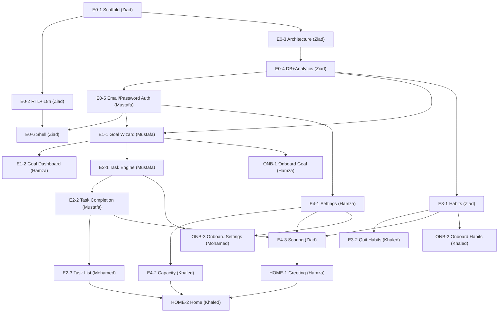

# 📋 Hadaf (هدف) — Team Task Assignments

> **Generated:** 2026-07-05 · **Source:** `team-task-breakdown.md`, `Epics.md`
> **Team:** Mustafa, Ziad, Hamza, Khaled, Mohamed
> **Duration:** 5 days · **Total:** 25 stories, ~99 SP
> **Rule:** Each person owns their story **end-to-end** — DB, Backend, Frontend, everything.
> **Focus:** Working MVP. Ship it, win it.

---

## 1. Team

| Name | Primary Track |
|---|---|
| **Mustafa** | Auth → Goals → Tasks core |
| **Ziad** | Infrastructure, DB, Habits, Scoring capstone |
| **Hamza** | Goal Dashboard, Settings, Home greeting, Onboarding |
| **Khaled** | Quit Habits, Capacity, Home assembly, Onboarding, Empty States |
| **Mohamed** | Task List, Onboarding, all Polish stories |

---

## 2. Full Assignment

| Story | Name | SP | Owner | Depends On | Day |
|---|---|---|---|---|---|
| **E0-1** | Project Scaffold & Design System | 2 | **Ziad** | — | Day 1 |
| **E0-2** | Typography & RTL Foundation | 3 | **Ziad** | E0-1 | Day 1 |
| **E0-3** | Layered Architecture Setup | 2 | **Ziad** | E0-1 | Day 1 |
| **E0-4** | Database Connection & Analytics | 3 | **Ziad** | E0-3 | Day 1 |
| **E0-5** | Email/Password Authentication | 5 | **Mustafa** | E0-4 | Day 1 |
| **E0-6** | App Shell & Edge Middleware | 4 | **Ziad** | E0-5, E0-2 | Day 2 |
| **E1-1** | SMART Goal Wizard & Foundation | 6 | **Mustafa** | E0-4, E0-5 | Day 2 |
| **E1-2** | Goal Dashboard & Detail View | 8 | **Hamza** | E1-1 | Day 3 |
| **E2-1** | Task Engine & Auto-Type Creation | 6 | **Mustafa** | E1-1 | Day 2–3 |
| **E2-2** | Task Completion Flows | 6 | **Mustafa** | E2-1 | Day 3 |
| **E2-3** | Task List & Backlog | 5 | **Mohamed** | E2-2 | Day 3–4 |
| **E3-1** | Build Habits & MVD | 5 | **Ziad** | E0-4 | Day 2 |
| **E3-2** | Quit Habits & Relapse Tracking | 3 | **Khaled** | E3-1 | Day 3 |
| **E4-1** | Day Types & Settings | 4 | **Hamza** | E0-5 | Day 2 |
| **E4-2** | Daily Capacity Intelligence | 4 | **Khaled** | E4-1 | Day 3 |
| **E4-3** | Scoring Engine & Progress Bar | 5 | **Ziad** | E2-2, E3-1, E4-1 | Day 3–4 |
| **HOME-1** | Adaptive Morning Greeting | 4 | **Hamza** | E1-1, E2-1, E4-3 | Day 4 |
| **HOME-2** | Home Screen Layout Assembly | 4 | **Khaled** | HOME-1, E2-3, E3-1, E4-2 | Day 4 |
| **ONB-1** | Onboarding Step 1 (Goal) | 3 | **Hamza** | E1-1 | Day 4–5 |
| **ONB-2** | Onboarding Step 2 (Habits+MVD) | 3 | **Khaled** | E3-1 | Day 4–5 |
| **ONB-3** | Onboarding Step 3 (Settings+Task) | 3 | **Mohamed** | E4-1, E2-1 | Day 4–5 |
| **POL-1** | Empty States for Every Screen | 3 | **Khaled** | all screens | Day 5 |
| **POL-2** | Loading Skeletons | 2 | **Mohamed** | all screens | Day 5 |
| **POL-3** | Error Toasts with Retry | 3 | **Mohamed** | all actions | Day 5 |
| **POL-4** | Confirmation Dialogs | 3 | **Mohamed** | all delete actions | Day 5 |

---

## 3. Per-Person Breakdown

### 🟢 Ziad — 7 stories, 24 SP

| Story | SP | Day |
|---|---|---|
| E0-1: Project Scaffold & Design System | 2 | Day 1 |
| E0-2: Typography & RTL Foundation | 3 | Day 1 |
| E0-3: Layered Architecture Setup | 2 | Day 1 |
| E0-4: Database Connection & Analytics | 3 | Day 1 |
| E0-6: App Shell & Edge Middleware | 4 | Day 2 |
| E3-1: Build Habits & MVD | 5 | Day 2 |
| E4-3: Scoring Engine & Progress Bar | 5 | Day 3–4 |

> Day 1: Builds the entire foundation (scaffold → fonts → folders → DB). Day 2: Shell + Habits. Day 3–4: Scoring capstone.

---

### 🔵 Mustafa — 4 stories, 23 SP

| Story | SP | Day |
|---|---|---|
| E0-5: Email/Password Authentication | 5 | Day 1 |
| E1-1: SMART Goal Wizard & Foundation | 6 | Day 2 |
| E2-1: Task Engine & Auto-Type Creation | 6 | Day 2–3 |
| E2-2: Task Completion Flows | 6 | Day 3 |

> Day 1: Auth (waits for Ziad's E0-4). Day 2: Goals. Day 2–3: Task engine + completion. Establishes all patterns others copy.

---

### 🟡 Hamza — 4 stories, 19 SP

| Story | SP | Day |
|---|---|---|
| E4-1: Day Types & Settings | 4 | Day 2 |
| E1-2: Goal Dashboard & Detail View | 8 | Day 3 |
| HOME-1: Adaptive Morning Greeting | 4 | Day 4 |
| ONB-1: Onboarding Step 1 (Goal) | 3 | Day 4–5 |

> Day 2: Settings (while waiting for E1-1). Day 3: Goal Dashboard (follows Mustafa's E1-1). Day 4–5: Home greeting + Onboarding.

---

### 🟠 Khaled — 5 stories, 17 SP

| Story | SP | Day |
|---|---|---|
| E3-2: Quit Habits & Relapse Tracking | 3 | Day 3 |
| E4-2: Daily Capacity Intelligence | 4 | Day 3 |
| HOME-2: Home Screen Layout Assembly | 4 | Day 4 |
| ONB-2: Onboarding Step 2 (Habits+MVD) | 3 | Day 4–5 |
| POL-1: Empty States for Every Screen | 3 | Day 5 |

> Day 3: Quit Habits + Capacity. Day 4: Home assembly. Day 4–5: Onboarding + Empty States.

---

### 🟣 Mohamed — 5 stories, 16 SP

| Story | SP | Day |
|---|---|---|
| E2-3: Task List & Backlog | 5 | Day 3–4 |
| ONB-3: Onboarding Step 3 (Settings+Task) | 3 | Day 4–5 |
| POL-2: Loading Skeletons | 2 | Day 5 |
| POL-3: Error Toasts with Retry | 3 | Day 5 |
| POL-4: Confirmation Dialogs | 3 | Day 5 |

> Day 3–4: Task List + Backlog. Day 4–5: Onboarding. Day 5: All polish.

---

## 4. Day-by-Day Plan

### Day 1 — Foundation

```
Ziad    → E0-1 (Scaffold) → E0-2 (RTL) → E0-3 (Architecture) → E0-4 (DB)
Mustafa → E0-5 (Email/Password Auth)  [starts after Ziad finishes E0-4]
Hamza   → Study docs, set up dev environment, read PRD + Architecture
Khaled  → Study docs, set up dev environment, read PRD + Architecture
Mohamed → Study docs, set up dev environment, read PRD + Architecture
```

### Day 2 — First Features (Two Parallel Tracks)

```
Track A:
  Mustafa → E1-1 (Goal Wizard) → starts E2-1 (Task Engine)

Track B:
  Ziad    → E0-6 (App Shell) → E3-1 (Build Habits)

Track C:
  Hamza   → E4-1 (Day Types & Settings)

Khaled + Mohamed → study the patterns Mustafa and Ziad are establishing
```

### Day 3 — Core Product (All 5 Working)

```
Mustafa → finishes E2-1 (Task Engine) → E2-2 (Task Completion)
Ziad    → starts E4-3 (Scoring Engine)
Hamza   → E1-2 (Goal Dashboard & Detail View)
Khaled  → E3-2 (Quit Habits) → E4-2 (Capacity Intelligence)
Mohamed → starts E2-3 (Task List & Backlog)
```

### Day 4 — Intelligence & Home

```
Mustafa → free — bug fixes, helping others, edge cases
Ziad    → finishes E4-3 (Scoring Engine)
Hamza   → HOME-1 (Morning Greeting) → starts ONB-1
Khaled  → HOME-2 (Home Assembly) → starts ONB-2
Mohamed → finishes E2-3 → starts ONB-3
```

### Day 5 — Onboarding & Polish & Ship

```
Mustafa → integration, bug fixes, final deploy
Ziad    → integration, bug fixes, final deploy
Hamza   → finishes ONB-1
Khaled  → finishes ONB-2 → POL-1 (Empty States)
Mohamed → finishes ONB-3 → POL-2 (Skeletons) → POL-3 (Error Toasts) → POL-4 (Dialogs)
```

---

## 5. Load Distribution

| Member | Stories | Total SP |
|---|---|---|
| **Ziad** | 7 | 24 |
| **Mustafa** | 4 | 23 |
| **Hamza** | 4 | 19 |
| **Khaled** | 5 | 17 |
| **Mohamed** | 5 | 16 |
| **Total** | **25** | **99** |

---

## 6. Dependency Chain



---

*Each person owns their stories completely. No handoffs. Ship it and win. 🏆*
